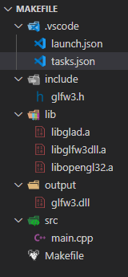
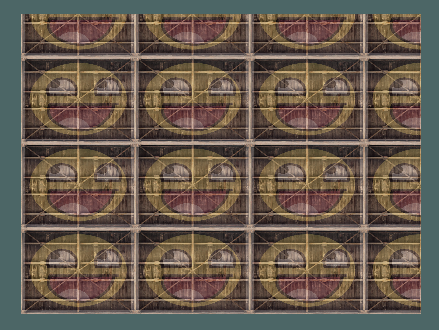
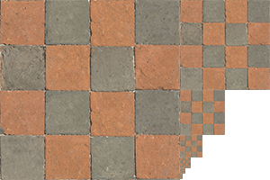
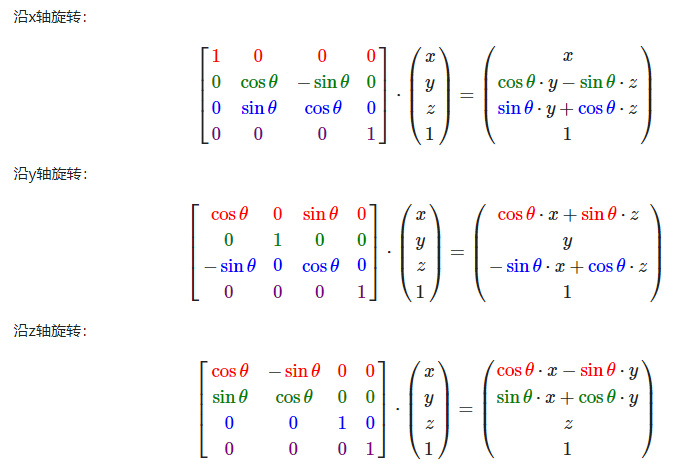

# OpenGL(3.3)

## 基础

> 源于：<https://learnopengl-cn.github.io/>

- 是 API，包含了一系列可以操作图形、图像的函数
- 是 一个由Khronos组织制定并维护的规范(Specification)

- 由于OpenGL的大多数实现都是由显卡厂商编写的，当产生一个bug时通常可以通过升级显卡驱动来解决
- OpenGL自身 是一个巨大的状态机(State Machine)：一系列的变量描述OpenGL此刻应当如何运行

- 核心模式与立即渲染模式
  - 立即渲染模式下，OpenGL的大多数功能都被库隐藏起来，开发者很少有控制OpenGL如何进行计算的自由，确实容易使用和理解，但是效率太低
  - OpenGL3.2开始，规范文档开始废弃立即渲染模式，并鼓励开发者在OpenGL的核心模式(Core-profile)下进行开发，这个分支的规范完全移除了旧的特性
  - 当使用OpenGL的核心模式时，OpenGL迫使我们使用现代的函数，现代函数要求使用者真正理解OpenGL和图形编程，提供了更多的灵活性，更高的效率
  - 所有OpenGL的更高的版本都是在3.3的基础上，引入了额外的功能，并没有改动核心架构

### 环境搭建

- CMake
  > CMake是一个工程文件生成工具。用户可以使用预定义好的CMake脚本，根据自己的选择（像是Visual Studio, Code::Blocks, Eclipse）生成不同IDE的工程文件

- 窗口
  - 创建OpenGL上下文(Context)和一个用于显示的窗口在每个系统上都是不一样的；需要自己处理创建窗口，定义OpenGL上下文以及处理用户输入
  - 最流行的几个库有 GLUT，SDL，SFML 和 GLFW

- GLFW
  > GLFW是一个专门针对OpenGL的C语言库，它提供了一些渲染物体所需的最低限度的接口。它允许用户创建OpenGL上下文，定义窗口参数以及处理用户输入
  - 下载源代码包：<http://www.glfw.org/download.html>
  - 只需要：编译生成的库 和 include文件夹

- GLAD
  > OpenGL只是一个标准/规范，具体的实现是由驱动开发商针对特定显卡实现的；由于OpenGL驱动版本众多，它大多数函数的位置都无法在编译时确定下来，需要在运行时查询；开发者需要在运行时获取函数地址并将其保存在一个函数指针中供以后使用；GLAD 库能简化此过程
  - 是一个在线服务 <http://glad.dav1d.de/>
    - 语言(Language)：C/C++
    - gl：3.3以上
    - Profile：Core
    - 生成加载器：是
  - 获取 zip 包

#### 基于 VS

- CMake 编译 GLFW 源码
  - 点击 Configure 选择 Visual Studio 版本

    
  - 点击 Generate 生成

#### 基于 VS Code

<https://www.cnblogs.com/zhong-dev/p/13859282.html>
<https://blog.csdn.net/sarono/article/details/86564726>

- MinGW
  - 下载离线包，解压，配置 path
  - 验证：gcc -v

- CMake 编译 GLFW 源码
  - 似上图，点击 Configure 选择 MinGW
  - 勾选 BUILD_SHARED_LIBS，点击 Generate 生成
  - 进入 build 目录，打开控制台，执行 mingw32-make 命令
  - 从 build/src 目录下得到 glfw3.dll，libglfw3dll.a 两个文件
  - 从 glfw-3.3.5\include\GLFW\ 获取 glfw3.h

- 配置 GLAD
  - 将 glad 编译成了静态库
  - 进入 glad 的目录（含有 include 和 src）

  ```sh
    gcc .\src\glad.c -c -I. \include\
    ar -rc libglad.a glad.o
  ```

  - 得到 glad.o 和 libglad.a 文件，libglad.a 是所需要的

- Vs Code OpenGL C++ 项目

  - 添加扩展 `C/C++ Project Generator`
    - Ctrl + Shift + P
    - Create c++ project

  - libopengl32 在 mingw 中

  - 2.0
    - main.cpp

      ```cpp
        #include <GL/gl.h>
        #include "glfw3.h"
      ```

    - Makefile，更新 `LFLAGS = ./lib/libglfw3dll.a ./lib/libopengl32.a`

    - 项目结构树

      

  - 3.3
    - main.cpp

    ```cpp
      #include <glad/glad.h>
      #include <GLFW/glfw3.h>
    ```

    - Makefile，更新 `LFLAGS = ./lib/libglfw3dll.a ./lib/libopengl32.a ./lib/libglad.a`

    - 项目结构树

      

  - Run - `mingw32-make run`

- `g++ main.cpp -o test libglfw3dll.a libopengl32.a`

### 概念

- `图形渲染管线(Graphics Pipeline)`

  .png)

- `顶点着色器(Vertex Shader)`：是把3D坐标转为另一种3D坐标，同时允许我们对顶点属性进行一些基本处理
  - 例：`GL_POINTS`、`GL_TRIANGLES`、`GL_LINE_STRIP`
- `图元装配(Primitive Assembly)`：将顶点着色器输出的所有顶点作为输入（如果是GL_POINTS，那么就是一个顶点），并所有的点装配成指定图元的形状
  - `图元(Primitive)`：基本图形元素是任何一个图形表达都是由若干不同的点、线、面图案或相同的图案循环组合而成的。这些点、线、面图案即为基本图形元素
- `几何着色器(Geometry Shader)`：可以通过产生新顶点构造出新的（或是其它的）图元来生成其他形状
- `裁切(Clipping)`：裁切会丢弃超出你的视图以外的所有像素，用来提升执行效率
- `光栅化阶段(Rasterization Stage)`：会把图元映射为最终屏幕上相应的像素，生成供片段着色器(Fragment Shader)使用的片段(Fragment)
  - `片段(Fragment)`：OpenGL中的一个片段是OpenGL渲染一个像素所需的所有数据
- `片段着色器(Fragment Shader)`：主要目的是计算一个像素的最终颜色，这也是所有OpenGL高级效果产生的地方

- `标准化设备坐标(Normalized Device Coordinates, NDC)`：一旦你的顶点坐标已经在顶点着色器中处理过，它们就应该是标准化设备坐标了，标准化设备坐标是一个x、y和z值在-1.0到1.0的一小段空间。任何落在范围外的坐标都会被丢弃/裁剪，不会显示在你的屏幕上
  - 标准化设备坐标接着会变换为屏幕空间坐标(Screen-space Coordinates)，这是使用你通过glViewport函数提供的数据，进行视口变换(Viewport Transform)完成的。所得的屏幕空间坐标又会被变换为片段输入到片段着色器中
- 深度：可以理解为z坐标，它代表一个像素在空间中和你的距离，如果离你远就可能被别的像素遮挡，你就看不到它了，它会被丢弃，以节省资源
- 视口(Viewport)：渲染窗口的尺寸大小
- 顶点数组对象(Vertex Array Object，VAO)：可以像顶点缓冲对象那样被绑定，任何随后的顶点属性调用都会储存在这个VAO中。这样的好处就是，当配置顶点属性指针时，你只需要将那些调用执行一次，之后再绘制物体的时候只需要绑定相应的VAO就行了。这使在不同顶点数据和属性配置之间切换变得非常简单，只需要绑定不同的VAO就行了。刚刚设置的所有状态都将存储在VAO中
  - OpenGL的核心模式要求我们使用VAO，所以它知道该如何处理我们的顶点输入。如果我们绑定VAO失败，OpenGL会拒绝绘制任何东西。
- 纹理像素：Texture Pixel也叫Texel，你可以想象你打开一张.jpg格式图片，不断放大你会发现它是由无数像素点组成的，这个点就是纹理像素
- 多级渐远纹理(Mipmap)
  - 简单来说就是一系列的纹理图像，后一个纹理图像是前一个的二分之一
  - 距观察者的距离超过一定的阈值，OpenGL会使用不同的多级渐远纹理，即最适合物体的距离的那个
- 模型矩阵(Model Matrix)：是一种变换矩阵，它能通过对物体进行位移、缩放、旋转来将它置于它本应该在的位置或朝向
- `投影(Projection)`：将特定范围内的坐标转化到标准化设备坐标系的过程（而且它很容易被映射到2D观察空间坐标）
- 平截头体(Frustum)：由投影矩阵创建的观察箱(Viewing Box)被称为平截头体(Frustum)
- 透视除法(Perspective Division)：是将4D裁剪空间坐标变换为3D标准化设备坐标的过程（将位置向量的x，y，z分量分别除以向量的齐次w分量）。这一步会在每一个顶点着色器运行的最后被自动执行。
- 透视(Perspective)：离越远的东西看起来更小，这个奇怪的效果称之为透视(Perspective)

### 简易流程

- 环境准备
  - glfw 初始化
  - glfw 设置 opengl 主次版本、启用核心模式等
  - glfw 创建窗口(并设置窗口变化时的视口调整回调函数)
  - gladLoadGLLoader，管理OpenGL的函数指针
- 绘制前准备
  - 创建着色器及程序对象
  - 链接程序后删除着色器对象
  - 使用glGenVertexArrays创建一个VAO
  - 使用glGenBuffers函数和一个缓冲ID生成一个VBO对象
  - 使用glBindVertexArray绑定VAO(需要放在`设置顶点属性指针`之前)
  - 使用glBindBuffer函数把新创建的缓冲绑定到GL_ARRAY_BUFFER目标
    - 顶点缓冲对象的缓冲类型是GL_ARRAY_BUFFER，OpenGL允许我们同时绑定多个缓冲，只要它们是不同的缓冲类型
  - 调用glBufferData函数，它会把之前定义的顶点数据复制到缓冲的内存中
  - glVertexAttribPointer 设置顶点属性指针
  - glEnableVertexAttribArray 启用顶点属性（此时数据已链接顶点属性）
  - 取消ARRAY_BUFFER的绑定
  - 取消 VAO 的绑定
- 窗口绘制
  - 清屏
  - 使用程序对象
  - 绑定 VAO
  - 绘制
  - 窗口相关
    - 交换窗口前后缓冲
    - 查看触发的事件
- 结束绘制
  - 清除 VAO
  - 清除 VBO
  - 删除 程序对象
  - 释放窗口资源

### Example

```cpp
#include <glad/glad.h>
#include <GLFW/glfw3.h>
#include <iostream>

using namespace std;

void frame_buffer_size_callback (GLFWwindow* window, int width, int height);
void processInput (GLFWwindow* window);

/*
 * 330: OpenGL3.3
 * core: 核心模式
 * layout (location = 0): 设定了输入变量的位置值(Location)
 * in: TODO
*/
const char* vertexShaderSource = "#version 330 core\n"
  "layout (location = 0) in vec3 aPos;\n"
  "void main()\n"
  "{\n"
  "   gl_Position = vec4(aPos.x, aPos.y, aPos.z, 1.0);\n"
  "}\0";
const char* fragShaderSource = "#version 330 core\n"
    "out vec4 FragColor;\n"
    "void main()\n"
    "{\n"
    "   FragColor = vec4(1.0f, 0.5f, 0.2f, 1.0f);\n"
    "}\n\0";

int main () {
  // glfw: initialize and configure
  // ------------------------------
  glfwInit(); // 初始化 glfw
  glfwWindowHint(GLFW_CONTEXT_VERSION_MAJOR, 3); // openGL 主版本号
  glfwWindowHint(GLFW_CONTEXT_VERSION_MINOR, 3); // openGL 次版本号
  glfwWindowHint(GLFW_OPENGL_PROFILE, GLFW_OPENGL_CORE_PROFILE); // 使用核心模式

// 如果使用的是Mac OS X系统
#ifdef __APPLE__
  glfwWindowHint(GLFW_OPENGL_FORWARD_COMPAT, GL_TRUE);
#endif

  // glfw window creation
  // --------------------
  // 创建窗口，失败时返回 NULL
  GLFWwindow* window = glfwCreateWindow(800, 600, "CreateGLFWWindow", NULL, NULL);
  if (!window) {
    cout<<"Failed to create GLFWwindow."<<endl;
    return -1;
  }
  glfwMakeContextCurrent(window);
  // 窗口调整大小时，回调
  glfwSetFramebufferSizeCallback(window, frame_buffer_size_callback);

  // glad: load all OpenGL function pointers
  // ---------------------------------------
  // GLAD是用来管理OpenGL的函数指针
  // GLFW给的是glfwGetProcAddress，它根据编译的系统定义了正确的函数
  if (!gladLoadGLLoader((GLADloadproc)glfwGetProcAddress)) {
    cout<<"Failed to initialize GLAD"<<endl;
    glfwTerminate();
    return -1;
  }

  // build and compile our shader program
  // ------------------------------------
  // vertex shader
  unsigned int vertexShader;
  // 创建一个顶点着色器
  vertexShader = glCreateShader(GL_VERTEX_SHADER);
  // 把要编译的着色器对象作为第一个参数。第二参数指定了传递的源码字符串数量，这里只有一个。第三个参数是顶点着色器真正的源码，第四个参数先设置为NULL
  glShaderSource(vertexShader, 1, &vertexShaderSource, NULL);
  glCompileShader(vertexShader);
  // check for shader compile errors
  int success;
  char infoLog[512];
  glGetShaderiv(vertexShader, GL_COMPILE_STATUS, &success);
  // 如果编译失败，我们会用glGetShaderInfoLog获取错误消息
  if (!success) {
    glGetShaderInfoLog(vertexShader, 512, NULL, infoLog);
    cout << "ERROR::SHADER::VERTEX::COMPILATION_FAILED\n" << infoLog << endl;
    return -1;
  }
  // fragment shader
  unsigned int fragmentShader;
  fragmentShader = glCreateShader(GL_FRAGMENT_SHADER);
  glShaderSource(fragmentShader, 1, &fragShaderSource, NULL);
  glCompileShader(fragmentShader);
  glGetShaderiv(fragmentShader, GL_COMPILE_STATUS, &success);
  if (!success) {
    glGetShaderInfoLog(fragmentShader, 512, NULL, infoLog);
    cout << "ERROR::SHADER::FRAGMENT::COMPILATION_FAILED\n" << infoLog << endl;
    return -1;
  }
  // program
  // 创建一个程序，并返回新创建程序对象的ID引用
  unsigned int shaderProgram;
  shaderProgram = glCreateProgram();
  glAttachShader(shaderProgram, vertexShader);
  glAttachShader(shaderProgram, fragmentShader);
  glLinkProgram(shaderProgram);
  glGetProgramiv(shaderProgram, GL_LINK_STATUS, &success);
  if (!success) {
    glGetProgramInfoLog(shaderProgram, 512, NULL, infoLog);
    cout << "ERROR::PROGRAM::LINK FAILED."<< endl;
    return -1;
  }
  glDeleteShader(vertexShader);
  glDeleteShader(fragmentShader);

  // set up vertex data (and buffer(s)) and configure vertex attributes
  // ------------------------------------------------------------------
  float vertices[] = {
    -0.5f, -0.5f, 0.0f,
    0.5f, -0.5f, 0.0f,
    0.0f, 0.5f, 0.0f
  };

  // 0. 复制顶点数组到缓冲中供OpenGL使用
  unsigned int VBO;
  // 使用glGenBuffers函数和一个缓冲ID生成一个VBO对象
  glGenBuffers(1, &VBO);
  // 把新创建的缓冲绑定到GL_ARRAY_BUFFER目标
  glBindBuffer(GL_ARRAY_BUFFER, VBO);
  glBufferData(GL_ARRAY_BUFFER, sizeof(vertices), vertices, GL_STATIC_DRAW);
  // OpenGL的核心模式要求我们使用VAO，所以它知道该如何处理我们的顶点输入。如果我们绑定VAO失败，OpenGL会拒绝绘制任何东西
  unsigned int VAO;
  // 1. 绑定VAO
  glGenVertexArrays(1, &VAO);
  glBindVertexArray(VAO);
  // 1. 设置顶点属性指针
  glVertexAttribPointer(0, 3, GL_FLOAT, GL_FALSE, 3 * sizeof(float), (void*)0);
  glEnableVertexAttribArray(0);

  // note that this is allowed, the call to glVertexAttribPointer registered VBO as the vertex attribute's bound vertex buffer object so afterwards we can safely unbind
  // 解除当前 ARRAY_BUFFER 的绑定
  glBindBuffer(GL_ARRAY_BUFFER, 0);

  // You can unbind the VAO afterwards so other VAO calls won't accidentally modify this VAO, but this rarely happens. Modifying other
  // VAOs requires a call to glBindVertexArray anyways so we generally don't unbind VAOs (nor VBOs) when it's not directly necessary.
  // 取消 VAO 的绑定
  glBindVertexArray(0);

  // 每次循环前检查一次GLFW是否被要求退出，如果是的话该函数返回true
  while (!glfwWindowShouldClose(window)) {
    processInput(window);

    // 渲染指令
    // ...
    // 设置清空屏幕所用的颜色（状态设置）
    glClearColor(.2f, .3f, .3f, 1.0f);
    // 当调用glClear函数，清除颜色缓冲之后，整个颜色缓冲都会被填充为glClearColor里所设置的颜色（状态使用）
    glClear(GL_COLOR_BUFFER_BIT);

    /* 第一个参数指定配置的顶点属性：`layout(location = 0)`
     * 第二个参数指定顶点属性的大小
     * 第三个参数指定数据的类型
     * 下个参数定义我们是否希望数据被标准化(Normalize)
     * 第五个参数叫做步长(Stride)，它告诉我们在连续的顶点属性组之间的间隔
     * 最后一个参数的类型是void*
    */
    // 2. 当我们渲染一个物体时要使用着色器程序
    glUseProgram(shaderProgram);
    glBindVertexArray(VAO);
    // 3. 绘制物体
    glDrawArrays(GL_TRIANGLES, 0, 3);

    // 前缓冲保存着最终输出的图像，它会在屏幕上显示；而所有的的渲染指令都会在后缓冲上绘制
    // 所有的渲染指令执行完毕后，交换(Swap)前缓冲和后缓冲，图像就立即呈显出来，不真实感就消除了
    glfwSwapBuffers(window);
    // 查有没有触发什么事件（比如键盘输入、鼠标移动等）、更新窗口状态，并调用对应的回调函数（可以通过回调方法手动设置）
    glfwPollEvents();
  }

  // optional: de-allocate all resources once they've outlived their purpose:
  // ------------------------------------------------------------------------
  glDeleteVertexArrays(1, &VAO);
  glDeleteBuffers(1, &VBO);
  glDeleteProgram(shaderProgram);
  // 正确释放/删除之前的分配的所有资源
  glfwTerminate();

  return 1;
}

// process all input: query GLFW whether relevant keys are pressed/released this frame and react accordingly
// ---------------------------------------------------------------------------------------------------------
void frame_buffer_size_callback (GLFWwindow* window, int width, int height) {
  // 调整视口
  // make sure the viewport matches the new window dimensions; note that width and 
  // height will be significantly larger than specified on retina displays.
  glViewport(0, 0, width, height);
}

// glfw: whenever the window size changed (by OS or user resize) this callback function executes
// ---------------------------------------------------------------------------------------------
void processInput (GLFWwindow* window) {
  // 如果没有按下，glfwGetKey将会返回GLFW_RELEASE
  if (glfwGetKey(window, GLFW_KEY_ESCAPE) == GLFW_PRESS) {
    glfwSetWindowShouldClose(window, true);
  }
}
```

### 注意点

- 从CPU把数据发送到显卡相对较慢，所以只要可能我们都要尝试尽量一次性发送尽可能多的数据
- 着色器数据传递到下一层的两种方式
  1. 使用默认变量：gl_FragColor
  2. 设置变量

  ```glsl
    // in vec4 color;
    out vec4 FragColor;
    void main () {
      FragColor = color;
    }
  ```
- 纹理重复排列顺序方向：左到右、下到上
- glsl 内部矩阵是列主序(Column-major Ordering)布局
- glsl 矩阵变换是基于上次位置变换，不是基于原点变换
- 使用深度测试时，需要每次渲染迭代之前清除深度缓冲（否则前一帧的深度信息仍然保存在缓冲中
- 深度测试，默认是 z 小的在上面

  
- 缩放变换，负值会导致物体被翻转

### 纹理

- 纹理环绕方式（GL_TEXTURE_WRAP_S / GL_TEXTURE_WRAP_T）/ （纹理坐标在范围之外）
  - GL_REPEAT：对纹理的默认行为。重复纹理图像。
  - GL_MIRRORED_REPEAT：和GL_REPEAT一样，但每次重复图片是镜像放置的。
  - GL_CLAMP_TO_EDGE：纹理坐标会被约束在0到1之间，超出的部分会重复纹理坐标的边缘，产生一种边缘被拉伸的效果。
  - GL_CLAMP_TO_BORDER：超出的坐标为用户指定的边缘颜色。
    - glTexParameterfv(GL_TEXTURE_2D, GL_TEXTURE_BORDER_COLOR, borderColor); // 边缘的颜色值

  

- 纹理过滤 （GL_TEXTURE_MIN_FILTER / GL_TEXTURE_MAG_FILTER）
  - GL_NEAREST（也叫邻近过滤，Nearest Neighbor Filtering），是OpenGL默认的纹理过滤方式。当设置为GL_NEAREST的时候，OpenGL会选择中心点最接近纹理坐标的那个像素

    

  - GL_LINEAR（也叫线性过滤，(Bi)linear Filtering），它会基于纹理坐标附近的纹理像素，计算出一个插值，近似出这些纹理像素之间的颜色。一个纹理像素的中心距离纹理坐标越近，那么这个纹理像素的颜色对最终的样本颜色的贡献越大

    

  - 放大(Magnify)和缩小(Minify)

  

- 多级渐远纹理(Mipmap)

  
  - glGenerateMipmaps
  - 在渲染中切换多级渐远纹理级别(Level)时，OpenGL在两个不同级别的多级渐远纹理层之间会产生不真实的生硬边界
    - filter
    - GL_NEAREST_MIPMAP_NEAREST
    - GL_LINEAR_MIPMAP_NEAREST
    - GL_NEAREST_MIPMAP_NEAREST
    - GL_LINEAR_MIPMAP_LINEAR
  - 多级渐远纹理主要是使用在纹理被缩小的情况下的：纹理放大不会使用多级渐远纹理，为放大过滤设置多级渐远纹理的选项会产生一个GL_INVALID_ENUM错误代码

- stb_image.h
  - 是Sean Barrett的一个非常流行的单头文件图像加载库，它能够加载大部分流行的文件格式，并且能够很简单得整合到工程之中
  - 下载地址：<https://github.com/nothings/stb/blob/master/stb_image.h>
  - 使用

    ```c++
      #define STB_IMAGE_IMPLEMENTATION
      #include "stb_image.h"
      
      int width, height, nrChannels;
      unsigned char* data = stbi_load("container.jpg", &width, &height, &nrChannels, 0);
    ```

  - 释放图像内存 - `stbi_image_free(data);`

- 当调用glTexImage2D时，当前绑定的纹理对象就会被附加上纹理图像。然而，目前只有基本级别(Base-level)的纹理图像被加载了，如果要使用多级渐远纹理，我们必须手动设置所有不同的图像（不断递增第二个参数）。或者，直接在生成纹理之后调用glGenerateMipmap。这会为当前绑定的纹理自动生成所有需要的多级渐远纹理

- 创建过程

  ```c++
    unsigned int texture;
    glGenTextures(1, &texture); // 创建
    glBindTexture(GL_TEXTURE_2D, texture);  // 绑定
    glTexImage(GL_TEXTURE_2D, 0, GL_RGB, width, height, 0, GL_RGB, GL_UNSIGNED_BYTE, data); // 写入图像数据到纹理
    glGenerateMipmap(GL_TEXTURE_2D); // 生成所有需要的多级渐远纹理
  ```

- 纹理上下颠倒了, OpenGL要求y轴0.0坐标是在图片的底部的，但是图片的y轴0.0坐标通常在顶部, 处理方法：
  - 颠倒图片：`stbi_set_flip_vertically_on_load(true)`
  - 翻转坐标
    - 翻转纹理坐标

      ```c++
        const float* vertices = {
          0.5f, -0.5f,   0.0f, 1.0f, 0.0f,   1.0f, 1.0f, // bottom right
          0.5f,  0.5f,   1.0f, 0.0f, 0.0f,   1.0f, 0.0f, // top right
          -0.5f, -0.5f,   0.0f, 0.0f, 1.0f,   0.0f, 1.0f, // bottom left
          -0.5f,  0.5f,   1.0f, 1.0f, 0.0f,   0.0f, 0.0f  // top left
        }

    - 翻转顶点坐标
  - 着色器内翻转坐标
    - gl_Position 的 Y 分量 - `gl_Position = vec4(apos.x, centerY - apos.y, 0.0, 1.0);`
    - texture 的 T 分量 - `texture(texture2, vec2(1 - oTexCoords.s, oTexCoords.t))`

### 变换

- Euler Angle Rotation

  

- 在组合矩阵时，先进行缩放操作，然后是旋转，最后才是位移，否则它们会（消极地）互相影响
- OpenGL没有自带任何的矩阵和向量知识，所以我们必须定义自己的数学类和函数
- GLM (OpenGL Mathematics)，专门为OpenGL量身定做的数学库 <https://sourceforge.net/projects/ogl-math/>

### 坐标系统

为了将坐标从一个坐标系变换到另一个坐标系，我们需要用到几个变换矩阵，最重要的几个分别是模型(Model)、观察(View)、投影(Projection)三个矩阵。我们的顶点坐标起始于局部空间(Local Space)，在这里它称为局部坐标(Local Coordinate)，它在之后会变为世界坐标(World Coordinate)，观察坐标(View Coordinate)，裁剪坐标(Clip Coordinate)，并最后以屏幕坐标(Screen Coordinate)的形式结束


- 局部空间
  - 局部空间是指物体所在的坐标空间，即对象最开始所在的地方
- 世界空间
  - 是指顶点相对于（游戏）世界的坐标
  - 物体的坐标会从局部变换到世界空间；该变换是由模型矩阵(Model Matrix)实现的
- 观察空间
  - 经常被人们称之OpenGL的摄像机(Camera)（所以有时也称为摄像机空间(Camera Space)或视觉空间(Eye Space)）
  - 是从摄像机的视角所观察到的空间
  - 通常是由一系列的位移和旋转的组合来完成，平移/旋转场景从而使得特定的对象被变换到摄像机的前方。这些组合在一起的变换通常存储在一个观察矩阵(View Matrix)里，它被用来将世界坐标变换到观察空间
- 裁剪空间
  - 为了将顶点坐标从观察变换到裁剪空间，我们需要定义一个投影矩阵(Projection Matrix)，它指定了一个范围的坐标，超出了范围的坐标会被裁剪
  - 如果只是图元(Primitive)，例如三角形，的一部分超出了裁剪体积(Clipping Volume)，则OpenGL会重新构建这个三角形为一个或多个三角形让其能够适合这个裁剪范围。
  - 将观察坐标变换为裁剪坐标的投影矩阵可以为两种不同的形式，每种形式都定义了不同的平截头体。我们可以选择创建一个正射投影矩阵(Orthographic Projection Matrix)或一个透视投影矩阵(Perspective Projection Matrix)。

#### 正射投影矩阵(Orthographic Projection Matrix)

- 定义了一个类似立方体的平截头体
- 创建一个正射投影矩阵需要指定可见平截头体的宽、高和长度


- 上面的平截头体定义了可见的坐标，它由由宽、高、近(Near)平面和远(Far)平面所指定
- 要创建一个正射投影矩阵，我们可以使用GLM的内置函数 `glm::ortho`

```c++
glm::ortho(0.0f, 800.0f, 0.0f, 600.0f, 0.1f, 100.0f);
```

#### 透视投影矩阵(Perspective Projection Matrix)


- 顶点坐标的每个分量都会除以它的w分量，距离观察者越远顶点坐标就会越小

```c++
glm::perspective(glm::radians(45.0f), (float)width/(float)height, 0.1f, 100.0f)
```

#### 组合到一起

$V_{cilp}=M{projection}·M{view}·M{model}·M{local}$

- 我们需要沿着z轴的正方向移动。我们会通过将场景沿着z轴负方向平移来实现。它会给我们一种我们在往后移动的感觉

### 摄像机

- 要定义一个摄像机，我们需要它在世界空间中的位置、观察的方向、一个指向它右测的向量以及一个指向它上方的向量


- 摄像机位置 - 一个三维坐标
- 摄像机方向
  - 摄像机位置向量 - 目标位置向量，标准化
  - `方向向量(Direction Vector)并不是最好的名字，因为它实际上指向从它到目标向量的相反方向（译注：注意看前面的那个图，蓝色的方向向量大概指向z轴的正方向，与摄像机实际指向的方向是正好相反的）`
- 右轴 - 右向量(Right Vector)
  - 代表摄像机空间的x轴的正方向
  - 上向量(Up Vector) 叉乘 方向向量
- 上轴 - 方向向量 叉乘 右向量

- 使用这些摄像机向量我们就可以创建一个LookAt矩阵了

  $$lookAt=\begin{bmatrix}
  {R_x}&{R_y}&{R_z}&{0}\\
  {U_x}&{U_y}&{U_z}&{0}\\
  {D_x}&{D_y}&{D_z}&{0}\\
  {0}&{0}&{0}&{1}\\
  \end{bmatrix}*\begin{bmatrix}
  {1}&{0}&{0}&{-P_{x}}\\
  {0}&{1}&{0}&{-P_{y}}\\
  {0}&{0}&{1}&{-P_{z}}\\
  {0}&{0}&{0}&{1}\\
  \end{bmatrix}$$

  - 其中 ***`R`*** 是右向量，***`U`*** 是上向量，***`D`*** 是方向向量 ***`P`*** 是摄像机位置向量
  - 注意，位置向量是相反的，因为我们最终希望把世界平移到与我们自身移动的相反方向
  - LookAt 矩阵就像它的名字表达的那样：它会创建一个看着(Look at)给定目标的观察矩阵
  - GLM 供了这些支持

    ```c++
      glm::mat4 view;
      view = glm::lookAt(
        glm::vec3(0.0f, 0.0f, 3.0f), 
        glm::vec3(0.0f, 0.0f, 0.0f), 
        glm::vec3(0.0f, 1.0f, 0.0f)
      );
    ```

    - 位置、目标和上向量

- 自由移动
- 移动速度
  - 处理器的能力不同，有些人可能会比其他人每秒绘制更多帧，也就是以更高的频率调用processInput函数
  - 图形程序和游戏通常会跟踪一个时间差(Deltatime)变量，它储存了渲染上一帧所用的时间。我们把所有速度都去乘以deltaTime值。结果就是，如果我们的deltaTime很大，就意味着上一帧的渲染花费了更多时间，所以这一帧的速度需要变得更高来平衡渲染所花去的时间

- 视角移动

### 函数

#### `Shader`

- glCreateShader(GL_VERTEX_SHADER);
- glShaderSource(vertexShader, 1, &vertexShaderSource, NULL);
  - 第二参数指定了传递的源码字符串数量
- glCompileShader(vertexShader);
  - glGetShaderiv(vertexShader, GL_COMPILE_STATUS, &success)
    - 检测在调用glCompileShader后编译是否成功
    - int  success;
  - glGetShaderInfoLog(vertexShader, 512, NULL, infoLog);
    - 获取消息
    - char infoLog[512];

#### `Program`

- shaderProgram = glCreateProgram();
- glAttachShader(shaderProgram, vertexShader);
- glLinkProgram(shaderProgram);
  - glGetProgramiv(shaderProgram, GL_LINK_STATUS, &success);
  - glGetProgramInfoLog(shaderProgram, 512, NULL, infoLog)

- glUseProgram(shaderProgram);
- glDeleteShader(vertexShader);

#### `Buffer`

- glGenBuffers(1, &VBO);
- glBindBuffer(GL_ARRAY_BUFFER, VBO);
- glBufferData(GL_ARRAY_BUFFER, sizeof(vertices), vertices, GL_STATIC_DRAW);
  - GL_STATIC_DRAW ：数据不会或几乎不会改变
  - GL_DYNAMIC_DRAW：数据会被改变很多
  - GL_STREAM_DRAW ：数据每次绘制时都会改变

#### `Pointer`

- glVertexAttribPointer(0, 3, GL_FLOAT, GL_FALSE, 3 *sizeof(float), (void*)0);

#### `Vertex Array Object`

- glBindVertexArray(VAO);
- glEnableVertexAttribArray(0);
- glDisableVertexAttribArray [?]

#### `Viewport`

- glViewport(0, 0, 800, 600);
  - 设置窗口的维度
  - 前两个参数控制窗口左下角的位置。第三个和第四个参数控制渲染窗口的宽度和高度（像素）

#### Uniform

- glUniformMatrix4fv(transformLoc, 1, GL_FALSE, glm::value_ptr(trans));
  - uniform的位置值
  - 将要发送多少个矩阵
  - 是否希望对我们的矩阵进行置换(Transpose)
  - 矩阵数据

#### Status

- 状态设置函数
  - glClearColor(0.3f, 0.4f, 0.4f, 1.0f);
    - 设置清空屏幕所用的颜色

- 状态使用函数
  - glClear(GL_COLOR_BUFFER_BIT)

#### Texture

- glTexImage2D(GL_TEXTURE_2D, GL_RGB, 0, width, height, 0, GL_RGB, GL_UNSIGNED_BYTE, data);
  - 第一个参数指定了纹理目标(Target)。设置为GL_TEXTURE_2D意味着会生成与当前绑定的纹理对象在同一个目标上的纹理（任何绑定到GL_TEXTURE_1D和GL_TEXTURE_3D的纹理不会受到影响）。
  - 第二个参数为纹理指定多级渐远纹理(mipmap)的级别，如果你希望单独手动设置每个多级渐远纹理的级别的话。这里我们填0，也就是基本级别。
  - 第三个参数告诉OpenGL我们希望把纹理储存为何种格式。我们的图像只有RGB值，因此我们也把纹理储存为RGB值。
  - 第四个和第五个参数设置最终的纹理的宽度和高度。我们之前加载图像的时候储存了它们，所以我们使用对应的变量。
  - 下个参数应该总是被设为0（历史遗留的问题）。
  - 第七第八个参数定义了源图的格式和数据类型。我们使用RGB值加载这个图像，并把它们储存为char(byte)数组，我们将会传入对应值。
  - 最后一个参数是真正的图像数据。
